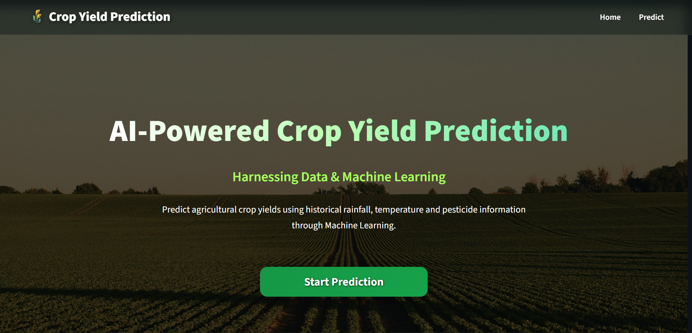
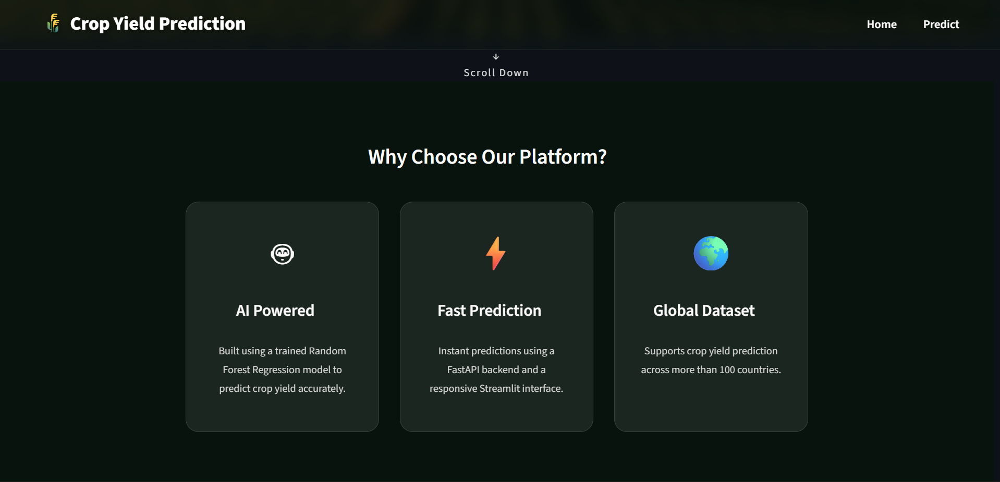
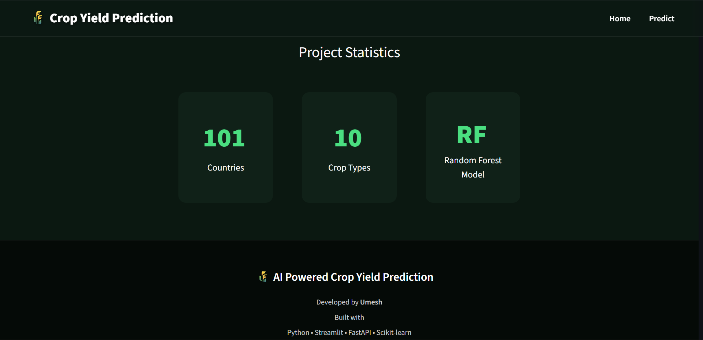
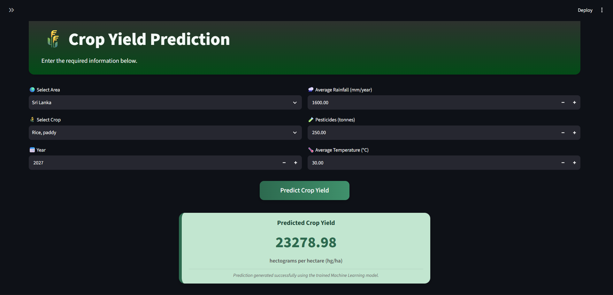
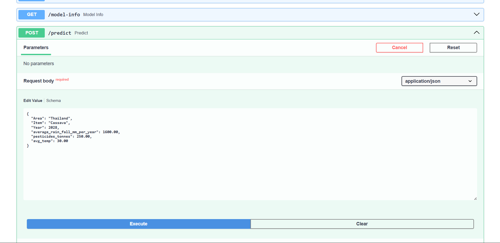
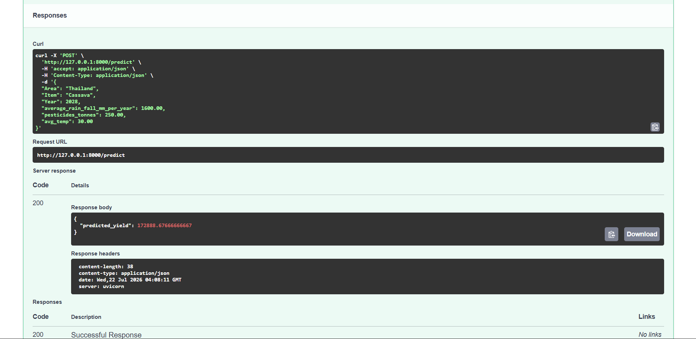

# 🌾 Crop Yield Prediction System

A Machine Learning web application that predicts crop yield based on environmental and agricultural factors.

The project uses a trained Random Forest Regression model and provides an interactive web interface built with Streamlit and a REST API developed using FastAPI.

---

## 🚀 Features

- 🌾 Predict crop yield instantly
- 🌍 Select Area and Crop
- 📅 Input Year
- 🌧 Enter Annual Rainfall
- 🧪 Enter Pesticide Usage
- 🌡 Enter Average Temperature
- ⚡ FastAPI backend for predictions
- 🎨 Modern Streamlit frontend
- 🤖 Machine Learning model using Random Forest Regression

---

## 🛠 Technologies Used

### Machine Learning

- Python
- Pandas
- NumPy
- Scikit-learn
- Joblib

### Backend

- FastAPI
- Uvicorn

### Frontend

- Streamlit
- HTML
- CSS

---

# 📸 Screenshots

## 🏠 Home Page

### Hero Section



### Features Section



### Statistics & Footer



---

## 🌾 Prediction Page



---

## ⚡ FastAPI Documentation





---

## 🤖 Machine Learning Model

- **Algorithm:** Random Forest Regressor
- **Task:** Crop Yield Prediction (Regression)
- **Target Variable:** Yield (hg/ha)
- **Input Features:**
  - Area
  - Crop
  - Year
  - Average Rainfall
  - Pesticides
  - Average Temperature

---

## 📊 Model Performance

| Metric | Before Tuning | After Tuning |
|---------|--------------:|-------------:|
| R² Score | 0.973286 |  0.973526 |
| MAE |  6553.024791 | 6509.605604 |
| RMSE |  13109.205642 | 13050.227046 |

---

## 📂 Project Structure

```text
Crop_Yield_Prediction/
│
├── backend/
│   └── app.py
│
├── frontend/
│   ├── Home.py
│   ├── pages/
│   ├── styles/
│   └── images/
│
├── models/
│   └── crop_yield_model.pkl
│
├── requirements.txt
├── main.py
└── README.md
```

---

## 🌐 Live Demo

Deployed application here:

🔗 https://

---

## 🚀 Getting Started

If you'd like to run the project locally, follow the installation steps below.

### Prerequisites

- Python 3.12
- Git

### Installation

1. Clone the repository

```bash
git clone https://github.com/           /Crop_Yield_Prediction.git
cd Crop_Yield_Prediction
```

2. Create a virtual environment

```bash
py -3.12 -m venv venv
```

3. Activate the virtual environment

**Windows (Git Bash)**

```bash
source venv/Scripts/activate
```

**Windows (Command Prompt)**

```cmd
venv\Scripts\activate
```

4. Install dependencies

```bash
pip install -r requirements.txt
```

5. Run the application

```bash
python main.py
```
